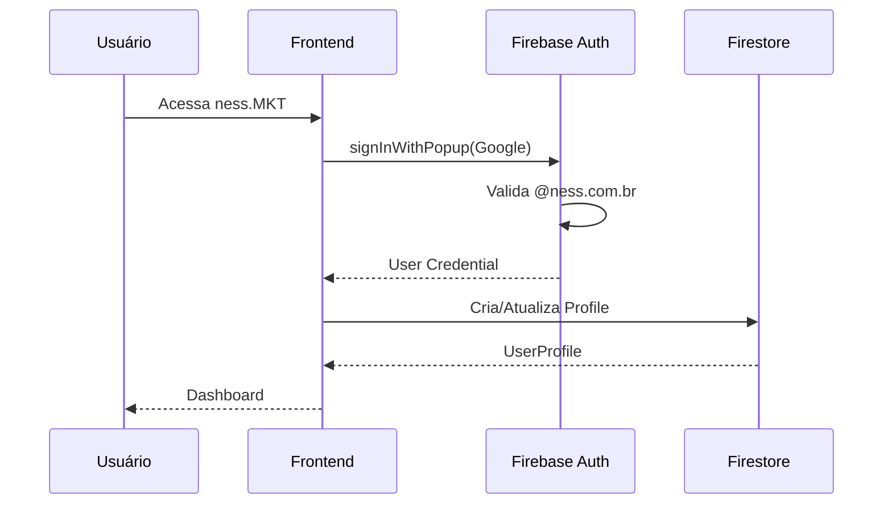

<p align="center">
  
  
  
  
</p>

<h1 align="center">ness.MKT</h1>

<p align="center">
  <strong>Marketing Toolkit da NESS</strong><br>
  <em>8 ferramentas profissionais de marketing em uma única plataforma</em>
</p>

<p align="center">
  <a href="#-módulos">Módulos</a> •
  <a href="#-arquitetura">Arquitetura</a> •
  <a href="#-instalação">Instalação</a> •
  <a href="#-deploy">Deploy</a> •
  <a href="#-documentação-da-api">API</a>
</p>

---

## 📋 Índice

- [Visão Geral](#-visão-geral)
- [Módulos](#-módulos)
- [Arquitetura](#-arquitetura)
- [Stack Tecnológica](#-stack-tecnológica)
- [Instalação](#-instalação)
- [Configuração](#-configuração)
- [Deploy](#-deploy)
- [Documentação da API](#-documentação-da-api)
- [Design System](#-design-system)
- [Estrutura do Projeto](#-estrutura-do-projeto)
- [Contribuição](#-contribuição)
- [Licença](#-licença)

---

## 🎯 Visão Geral

**ness.MKT** é uma plataforma completa de ferramentas de marketing para colaboradores NESS. Parte do ecossistema **ness.OS**, oferece 8 módulos integrados para criação de materiais profissionais com conformidade total à identidade visual da marca.

### Público-Alvo

| Perfil | Módulos Principais |
|--------|-------------------|
| **C-Levels** | Propostas, Apresentações, Press Kit |
| **Comercial** | Propostas, Templates Email, Cartões |
| **Marketing** | Redes Sociais, Press Kit, Manual Marca |
| **Todos** | Assinaturas, Cartões de Visita |

### Benefícios

- ✅ **Padronização** - Conformidade total com a marca NESS
- ✅ **Produtividade** - Templates prontos para uso imediato
- ✅ **Acessibilidade** - Disponível 24/7 via web
- ✅ **Integração** - Sincronizado com ness.PEOPLE
- ✅ **Segurança** - Acesso restrito a @ness.com.br

---

## 📦 Módulos

### 1. ✍️ Signatures (Assinaturas)

**Rota:** `/assinaturas`

Gerador de assinaturas de e-mail profissionais com:

| Recurso | Descrição |
|---------|-----------|
| 4 Templates | Clássico, Moderno, Minimal, Corporativo |
| 3 Temas | Branco, Azul, Dark |
| Exportação | HTML, PNG, JPEG, QR Code |
| Compartilhamento | Link público com contador de views |
| Histórico | Até 10 versões por assinatura |

**Áreas Suportadas:**
```
CEO, CFO, CTO, COO, CMO, CIO, CSO, CHRO, CPO, CDO
n.secops, n.infraops, n.devarch, n.autoops, n.privacy, n.cirt, n.discovery
Operations, Security, Forensic, Finance, HR, Facilities
```

---

### 2. 📖 Brand Manual (Manual da Marca)

**Rota:** `/manual-marca`

Diretrizes completas da identidade visual NESS:

| Seção | Conteúdo |
|-------|----------|
| Logo | Versões, espaçamentos, usos incorretos |
| Cores | Paleta primária e secundária |
| Tipografia | Montserrat - pesos e tamanhos |
| Aplicações | Papelaria, digital, sinalização |

---

### 3. 💳 Business Cards (Cartões de Visita)

**Rota:** `/cartao-visita`

Gerador de cartões de visita digitais e para impressão:

| Formato | Uso |
|---------|-----|
| Digital | QR Code para compartilhar contato |
| Print 85x55mm | PDF para gráfica |
| VCard | Arquivo .vcf para importar |

---

### 4. 📧 Email Templates (Templates de Email)

**Rota:** `/templates-email`

Templates prontos para campanhas de email marketing:

| Template | Finalidade |
|----------|------------|
| Boas-vindas | Onboarding de clientes |
| Newsletter | Atualizações mensais |
| Promocional | Campanhas e ofertas |
| Transacional | Confirmações e notificações |
| Institucional | Comunicados corporativos |

---

### 5. 📊 Presentations (Apresentações)

**Rota:** `/apresentacoes`

Templates de apresentações corporativas:

| Categoria | Templates |
|-----------|-----------|
| Corporativo | Institucional, Quem Somos |
| Comercial | Proposta Comercial, Pitch Deck |
| Técnico | Case Study, Relatório Técnico |
| Treinamento | Onboarding, Workshop |

**Integração Gamma.app:** Geração automática de apresentações via IA

---

### 6. 📱 Social Media (Redes Sociais)

**Rota:** `/redes-sociais`

Guias e templates para redes sociais:

| Plataforma | Conteúdo |
|------------|----------|
| LinkedIn | Posts, artigos, banners |
| Instagram | Feed, Stories, Reels |
| Twitter/X | Posts, threads |
| YouTube | Thumbnails, banners |

**Inclui:** Tamanhos recomendados, templates PSD/Figma

---

### 7. 📄 Proposals (Propostas)

**Rota:** `/propostas`

Sistema de propostas comerciais:

| Recurso | Descrição |
|---------|-----------|
| Templates | Proposta Padrão, Enterprise, Consultoria |
| Integração | Gamma.app para apresentações |
| Tracking | Status: draft, sent, accepted, rejected |
| Versionamento | Histórico de revisões |

---

### 8. 📰 Press Kit (Kit de Imprensa)

**Rota:** `/press-kit`

Materiais para imprensa e mídia:

| Categoria | Arquivos |
|-----------|----------|
| Logos | PNG, SVG, EPS |
| Fotos | Executivos, escritório, eventos |
| Releases | Templates de press release |
| Factsheet | Dados institucionais |

---

## 🏗️ Arquitetura

```
┌─────────────────────────────────────────────────────────────────┐
│                        ness.MKT Platform                        │
├─────────────────────────────────────────────────────────────────┤
│                                                                 │
│  ┌─────────────────┐    ┌─────────────────┐    ┌─────────────┐ │
│  │   Next.js 16    │    │  Firebase Auth  │    │  Firestore  │ │
│  │   (Frontend)    │◄──►│  (@ness.com.br) │    │  (Database) │ │
│  │                 │    │                 │    │             │ │
│  │  • App Router   │    │  • Google OAuth │    │  signatures │ │
│  │  • Static Export│    │  • Demo Mode    │    │  proposals  │ │
│  │  • TypeScript   │    │                 │    │  brandAssets│ │
│  └────────┬────────┘    └─────────────────┘    └─────────────┘ │
│           │                                                     │
│           │  /api/*                                             │
│           ▼                                                     │
│  ┌─────────────────────────────────────────────────────────────┐│
│  │              Firebase Cloud Functions                       ││
│  │                                                             ││
│  │  • getSignatures      • createSignature                     ││
│  │  • getSignatureBySlug • getProposals                        ││
│  │  • createProposal     • getProposals                        ││
│  └─────────────────────────────────────────────────────────────┘│
│                                                                 │
└─────────────────────────────────────────────────────────────────┘
                              │
                              ▼
              ┌───────────────────────────────┐
              │      Firebase Hosting         │
              │                               │
              │  ness-mkt.web.app             │
              │  ness-mkt.firebaseapp.com     │
              └───────────────────────────────┘
```

### Fluxo de Autenticação



---

## 🛠️ Stack Tecnológica

### Frontend

| Tecnologia | Versão | Propósito |
|------------|--------|-----------|
| [Next.js](https://nextjs.org/) | 16.x | Framework React com App Router |
| [TypeScript](https://www.typescriptlang.org/) | 5.x | Tipagem estática |
| [Tailwind CSS](https://tailwindcss.com/) | 4.x | Estilização utilitária |
| [shadcn/ui](https://ui.shadcn.com/) | Latest | Componentes UI |
| [Lucide Icons](https://lucide.dev/) | Latest | Ícones |

### Backend & Infra

| Tecnologia | Propósito |
|------------|-----------|
| [Firebase Hosting](https://firebase.google.com/products/hosting) | Hospedagem estática |
| [Firebase Functions](https://firebase.google.com/products/functions) | API serverless |
| [Firebase Auth](https://firebase.google.com/products/auth) | Autenticação OAuth |
| [Firestore](https://firebase.google.com/products/firestore) | Banco NoSQL |

### Dependências Principais

```json
{
  "firebase": "12.x",
  "firebase-admin": "13.x",
  "qrcode": "Geração de QR Codes",
  "html-to-image": "Exportação de imagens",
  "nanoid": "IDs únicos",
  "sonner": "Notificações toast"
}
```

---

## 📦 Instalação

### Pré-requisitos

- **Bun** >= 1.x (recomendado) ou Node.js >= 18.x
- **Git**
- **Conta Firebase** (para produção)

### Desenvolvimento Local

```bash
# Clone o repositório
git clone https://github.com/resper1965/ness.MKT.git
cd ness.MKT

# Instale as dependências
bun install

# Instale dependências das Functions
cd functions && npm install && cd ..

# Configure variáveis de ambiente
cp .env.example .env.local

# Inicie o servidor de desenvolvimento
bun run dev
```

### Acesso Local

```
http://localhost:3000
```

**Modo Demo:** Disponível automaticamente sem configuração Firebase

---

## ⚙️ Configuração

### Variáveis de Ambiente

Crie `.env.local` na raiz:

```env
# Firebase Client (obrigatório para produção)
NEXT_PUBLIC_FIREBASE_API_KEY=your-api-key
NEXT_PUBLIC_FIREBASE_AUTH_DOMAIN=ness-mkt.firebaseapp.com
NEXT_PUBLIC_FIREBASE_PROJECT_ID=ness-mkt
NEXT_PUBLIC_FIREBASE_STORAGE_BUCKET=ness-mkt.firebasestorage.app
NEXT_PUBLIC_FIREBASE_MESSAGING_SENDER_ID=your-sender-id
NEXT_PUBLIC_FIREBASE_APP_ID=your-app-id

# Gamma AI (opcional, para apresentações)
GAMMA_API_KEY=your-gamma-api-key
GAMMA_THEME_ID=your-theme-id
```

### Firebase Service Account

Para Cloud Functions, configure no GitHub Secrets:

```
FIREBASE_SERVICE_ACCOUNT={"type":"service_account",...}
```

### Áreas e Departamentos

Edite `src/lib/organization.ts` para customizar:

```typescript
export const departments = {
  executive: ['ceo', 'cfo', 'cto', 'coo', 'cmo', 'cio', 'cso', 'chro', 'cpo', 'cdo'],
  operations: ['secops', 'infraops', 'devarch', 'autoops', 'privacy', 'cirt', 'discovery'],
  backoffice: ['finance', 'hr', 'facilities'],
}
```

---

## 🚀 Deploy

### Automático (GitHub Actions)

O deploy é automático a cada push no branch `master`:

```yaml
# .github/workflows/firebase-deploy.yml
on:
  push:
    branches: [master]
```

**Status:** https://github.com/resper1965/ness.MKT/actions

### URLs de Produção

| URL | Descrição |
|-----|-----------|
| https://ness-mkt.web.app | Principal |
| https://ness-mkt.firebaseapp.com | Alternativa |

### Deploy Manual

```bash
# Build local
bun run build

# Build Functions
cd functions && npm run build && cd ..

# Deploy (requer Firebase CLI)
firebase deploy
```

### Secrets Necessários (GitHub)

| Secret | Descrição |
|--------|-----------|
| `FIREBASE_TOKEN` | Token CI do Firebase |
| `FIREBASE_SERVICE_ACCOUNT` | JSON do service account |
| `NEXT_PUBLIC_FIREBASE_*` | Configs do Firebase |
| `GAMMA_API_KEY` | API key do Gamma.app |

---

## 📚 Documentação da API

### Base URL

```
https://us-central1-ness-mkt.cloudfunctions.net
```

### Endpoints

#### `GET /api/signatures`

Lista todas as assinaturas.

**Response:**
```json
{
  "signatures": [
    {
      "id": "abc123",
      "nome": "João",
      "sobrenome": "Silva",
      "area": "cto",
      "email": "joao.silva@ness.com.br",
      "slug": "Xk9mN2pQ",
      "views": 42
    }
  ]
}
```

---

#### `POST /api/signatures`

Cria uma nova assinatura.

**Request:**
```json
{
  "nome": "João",
  "sobrenome": "Silva",
  "area": "cto",
  "cargo": "CTO | Chief Technology Officer",
  "email": "joao.silva@ness.com.br",
  "telefone": "11 99999-9999",
  "linkedin": "joaosilva",
  "whatsapp": "11 99999-9999",
  "template": "modern",
  "theme": "branco"
}
```

**Response:**
```json
{
  "signature": {
    "id": "abc123",
    "slug": "Xk9mN2pQ",
    ...
  },
  "shareUrl": "/s/Xk9mN2pQ"
}
```

---

#### `GET /api/signatures/:slug`

Retorna assinatura por slug.

**Response:**
```json
{
  "signature": {
    "id": "abc123",
    "slug": "Xk9mN2pQ",
    "nome": "João",
    "sobrenome": "Silva",
    ...
  }
}
```

---

#### `GET /api/proposals`

Lista todas as propostas.

---

#### `POST /api/proposals`

Cria uma nova proposta.

**Request:**
```json
{
  "title": "Proposta de Serviços",
  "clientName": "Empresa XYZ",
  "clientEmail": "contato@xyz.com",
  "description": "Descrição da proposta...",
  "value": "R$ 50.000,00",
  "status": "draft"
}
```

---

### Códigos de Status

| Código | Descrição |
|--------|-----------|
| `200` | Sucesso |
| `201` | Criado com sucesso |
| `400` | Requisição inválida |
| `404` | Recurso não encontrado |
| `405` | Método não permitido |
| `500` | Erro interno |

---

## 🎨 Design System

### Paleta de Cores

| Nome | Hex | Uso |
|------|-----|-----|
| **Primary** | `#00ade8` | Cor principal |
| **Primary Hover** | `#008bb8` | Hover |
| **Background** | `#0f172a` | Fundo dark |
| **Card** | `#1e293b` | Cards |
| **Border** | `#334155` | Bordas |
| **Text** | `#f1f5f9` | Texto |

### Logo

```html
<!-- ✅ Correto -->
<span class="text-2xl font-medium">
  ness<span class="text-[#00ade8]">.</span>
</span>

<!-- ❌ Incorreto -->
NESS.
NESS
ness
```

### Tipografia

| Elemento | Fonte | Peso |
|----------|-------|------|
| Logo | Montserrat | 500 |
| Títulos | Montserrat | 600 |
| Corpo | Montserrat | 400 |
| Labels | Montserrat | 700 |

---

## 📁 Estrutura do Projeto

```
ness.MKT/
├── .github/
│   └── workflows/
│       └── firebase-deploy.yml     # CI/CD
│
├── functions/                      # Cloud Functions
│   ├── src/
│   │   └── index.ts               # API endpoints
│   ├── package.json
│   └── tsconfig.json
│
├── src/
│   ├── app/                       # Next.js App Router
│   │   ├── page.tsx              # Dashboard
│   │   ├── layout.tsx            # Layout principal
│   │   ├── globals.css           # Estilos globais
│   │   │
│   │   ├── apresentacoes/        # Módulo Apresentações
│   │   ├── assinaturas/          # Módulo Assinaturas
│   │   ├── cartao-visita/        # Módulo Cartões
│   │   ├── manual-marca/         # Módulo Manual
│   │   ├── press-kit/            # Módulo Press Kit
│   │   ├── propostas/            # Módulo Propostas
│   │   ├── redes-sociais/        # Módulo Redes Sociais
│   │   ├── templates-email/      # Módulo Templates
│   │   └── s/                    # Página compartilhada
│   │
│   ├── components/
│   │   ├── ui/                   # shadcn/ui components
│   │   └── providers.tsx         # Context providers
│   │
│   ├── contexts/
│   │   └── AuthContext.tsx       # Autenticação Firebase
│   │
│   ├── lib/
│   │   ├── firebase.ts           # Firebase client
│   │   ├── firebase-admin.ts     # Firebase admin
│   │   └── organization.ts       # Departamentos/áreas
│   │
│   └── services/
│       └── firestore.ts          # Firestore operations
│
├── firebase.json                  # Firebase config
├── .firebaserc                    # Firebase project
├── package.json
├── tailwind.config.ts
├── tsconfig.json
└── README.md
```

---

## 🤝 Contribuição

### Fluxo de Trabalho

1. **Fork** o repositório
2. **Crie uma branch**: `git checkout -b feature/nova-funcionalidade`
3. **Commit**: `git commit -m 'feat: descrição'`
4. **Push**: `git push origin feature/nova-funcionalidade`
5. **Pull Request**

### Padrões de Commit

| Tipo | Descrição |
|------|-----------|
| `feat` | Nova funcionalidade |
| `fix` | Correção de bug |
| `docs` | Documentação |
| `style` | Formatação |
| `refactor` | Refatoração |
| `test` | Testes |
| `chore` | Manutenção |

### Convenções de Código

- **TypeScript** estrito
- **ESLint** para linting
- **Prettier** para formatação
- Componentes funcionais com hooks
- CSS com Tailwind (evitar CSS-in-JS)

---

## 📊 Roadmap

### v1.1 (Próximo)

- [ ] Upload de fotos de perfil
- [ ] Assinaturas em massa (CSV)
- [ ] Dashboard administrativo
- [ ] Analytics de visualizações

### v1.2 (Futuro)

- [ ] Integração Gamma completa
- [ ] Webhooks para notificações
- [ ] API pública documentada
- [ ] Múltiplos idiomas (EN, ES)

---

## 📄 Licença

```
© 2026 NESS Cybersecurity & Tech Solutions.
Todos os direitos reservados.

Uso restrito a colaboradores e parceiros autorizados.
```

---

## 📞 Suporte

| Canal | Contato |
|-------|---------|
| **Website** | [ness.com.br](https://www.ness.com.br) |
| **Email** | contato@ness.com.br |
| **GitHub** | [github.com/resper1965/ness.MKT](https://github.com/resper1965/ness.MKT) |

---

<p align="center">
  <strong>ness.MKT</strong><br>
  <em>Part of ness.OS ecosystem</em>
</p>

<p align="center">
  <a href="https://ness-mkt.web.app" target="_blank">
    
  </a>
</p>
